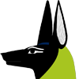

<br/>
<br/>

#  K8sLand Labs

# K8sLand Level1 Lab Validation

This repo contains labs validators for K8sland level1 labs.

To validate your lab:

1. cd to the corresponding lab number
2. Edit the job.yml manifest and replace the `-u=fernand` with your own name
3. Deploy!

      ```shell
      kubectl apply -f k8s
      ```

4. Your instructor will notify you with your results
5. You can change your solution and re-submit the validation using:

     ```shell
     kubectl delete -f k8s && kubectl apply -f k8s
     ```

---
 © 2020 Imhotep Software LLC.
All materials licensed under [Apache v2.0](http://www.apache.org/licenses/LICENSE-2.0)
